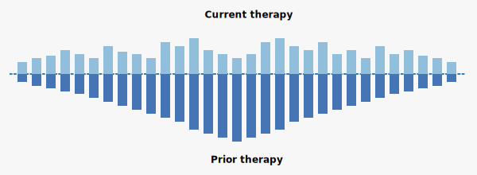

## icebeRgPlot: Visualising treatment responses in oncology

### Overview
The `icebeRgPlot` package is the R implementation of a novel visualisation method described by Lythgoe et al., which is used for comparing current and prior treatment responses in oncology clinical research. 

The iceberg plot displays current therapy response above a 'waterline' and prior therapy response below, allowing direct visual comparison of treatment sequencing efficacy on a person-by-person basis.

<p align="center">  </p>

This visualisation addresses a gap in oncology data display, where current graphical methods fail to adequately show prior treatment responses, focusing only on current treatments in isolation.

### Background
As described by Lythgoe et al., modern clinical cancer research increasingly relies on the visual communication of complex response and treatment sequencing data. The iceberg plot was developed to show what was previously 'hidden beneath the surface', i.e. the critical context of how individuals responded to prior treatments.
This code and its package implement the specific methodology described in the supplementary appendix of the original publication, including the distinctive person ordering algorithm that places individuals with maximum prior therapy response in the center, creating the characteristic 'iceberg' shape.

### Structure and use
This repository consists of several R files:

| File | Description | Main functions |
|------|-------------|---------------|
| `01_data_prep.R` | prepare data and person ordering | `iceberg_data()`, `long_to_wide()`, `calculate_von_hoff()` |
| `02_iceberg_plot.R` | core and fancy plotting | `iceberg_plot()`, `iceberg_theme()`, `iceberg_style()`, `visualise_von_hoff()` |
| `03_example.R` | workflow code | includes all functions |

*Workflow overview*
your_data -> long_to_wide(if_pivot_needed) -> iceberg_data(get_x_axis_location) -> calculate_von_hoff(calculate_pfs_ratio)
iceberg_plot(basic_iceberg) -> iceberg_theme(if_want_fancy_theme) + iceberg_style(if_want_better_style) -> visualise_von_hoff(to_see_exceptional_responders)

### Data requirements
The data is expected to be in wide format, i.e. one row per person. This means that each person appears exactly once.
If your data is in long format, you can either pivot to wide, or use the `long_to_wide()` function provided to help you with the pivoting.

Required variables:

- type and duration of 'prior therapy' 
- type and duration of 'current therapy' 
- other attributes needed, such as response to therapies, genomic alterations, etc. are in other columns


### Research applications
The iceberg plot can be leveraged for:

1. **Treatment sequencing studies** -- comparing how current therapy performs against prior treatments
2. **Precision oncology trials** -- evaluating whether genomically-matched therapies outperform previous standard approaches
3. **Clinical decision support** -- helping clinicians visualise a therapy's efficacy in context
4. **Exceptional responder analysis** -- identifying individuals who experience substantial benefit from a new therapy


### How to cite
If you use this code or its package (coming up) in your research, please cite:

1. This code/package R implementation:
   ```
   Franchini F. (2025). icebeRgPlot: R Package for visualising treatment responses in oncology. 
   GitHub repository, https://github.com/fannychini/iceberg
   ```
   
2. The original paper that introduced the iceberg plot concept:
   ```
   Mark P. Lythgoe, Timothée Olivier, Vinay Prasad. The iceberg plot, improving the visualisation of therapy response in oncology in the era of sequence-directed therapy,
   European Journal of Cancer, Volume 159, 2021, Pages 56-59, ISSN 0959-8049, https://doi.org/10.1016/j.ejca.2021.09.034.
   ```

### License

[](https://www.gnu.org/licenses/gpl-3.0)
This package is released under the GNU General Public License v3.0 (GPL-3.0).

This means:
- You are free to use, modify, and distribute this code
- If you distribute modified versions, you must also distribute them under GPL-3.0
- Any software that incorporates this code must also be released under GPL-3.0
- Full license details can be found in the LICENSE file or at https://www.gnu.org/licenses/gpl-3.0.html

